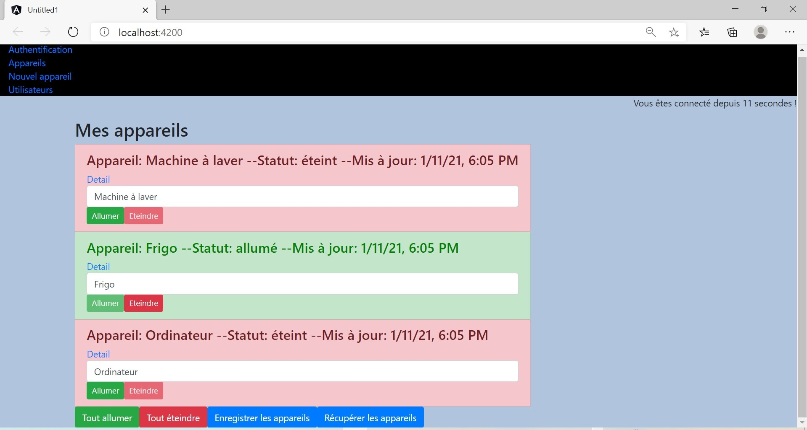

# House Project 
***
<a name="general-info"></a>
<a name="technologies"></a>
<a name="installation"></a>
<a name="screenshot"></a>
<a name="code scaffolding"></a>
<a name="side information"></a>
## General Info
### Screenshot

The electric devices in the house.

Project carried out following the course Develop Web Applications with Angular followed at OpenClassrooms (https://openclassrooms.com)
* A few words about the app:
  * requires authentication.
  * if you enter a path in the navigation bar that is not directly supported by your application, you are redirected to / not-found and therefore component 404  
  * there is a model class for users with:
    * first name, last name
    * email
    * favorite drink
    * hobbies 
  * the users can be added (validators required, but not for the hobbies).  
  * after authentication, the electric devices can be viewed as a complete list and then individually.  
  * the electric devices can be added/modified. 
* backend with the Google service: Firebase.This service allows the creation of a complete backend without coding, and node includes a lot of services, including authentication, a NoSQL database and file storage.

## Technologies
* Angular CLI: 10.1.6
* Node: 14.15.4
* OS: win32 x64
* RxJs Library 6.6.0

## Installation
* git clone https://github.com/ioanamatac/house-project-Angular.git
* cd../path/to/the/file
* ng build
* ng serve
* Navigate to `http://localhost:4200/`

## Code scaffolding

* Run `ng generate component component-name` to generate a new component.
* You can also use `ng generate directive|pipe|service|class|guard|interface|enum|module`.

##  Side Information
_Using the Google Service, Firebase:_
1. After the settings into the Firebase (https://firebase.google.com), I added HttpClient into the app.module.ts
2. @Injectable appareil.service.ts : 
  
  
_Each record should overwrite the previous one in the NoSQL database: for that, use the put () method instead_
```Angular
constructor(private httpClient: HttpClient) {
  } 
```
 ```Angular
saveAppareilsToServer(){
      this.httpClient.put('https://house-back.firebaseio.com/appareils.json', this.appareils)
        .subscribe(
          () => {
          console.log('Enregistrement terminé !');
        },
          (error) => {
            console.log('Erreur de sauvegarde !' + error);
          }
        );
  }
  getAppareilsFromServer(){
      this.httpClient
        .get<any[]>('https://house-back.firebaseio.com/appareils.json')
        .subscribe(
          (response) => {
          this.appareils = response;
          this.emitAppareilsSubject();
    },
          (error ) => {
            console.log('Erreur de chargement !' + error);
          }
        );
``` 
_And of course :_ :)
```Html
<button class="btn btn-primary"
          (click)="onSave()">Enregistrer les appareils</button>
    <button class="btn btn-primary"
          (click)="onFetch()">Récupérer les appareils</button>
```
---
Enjoy ! :)

Ioana
